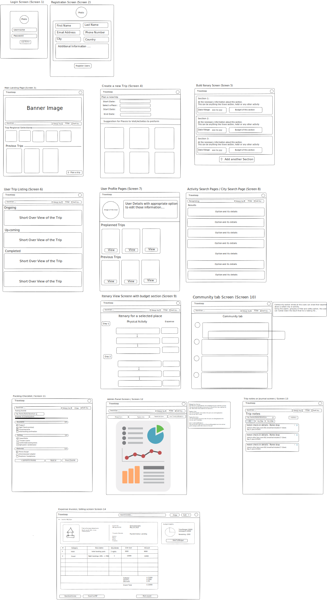

# ✈️ TRAVELOOP
> **Intelligent & Collaborative Travel Planning**

Traveloop is a personalized, intelligent, and collaborative platform that transforms the way individuals plan and experience travel. It empowers users to dream, design, and organize multi-city trips with ease by offering an end-to-end tool that combines flexibility and interactivity.

---

### 🔄 APPLICATION FLOW
<p align="center">
  
</p>

---

### 🔑 DEMO CREDENTIALS
Explore the platform using these pre-configured accounts:

#### 👑 Administrative Access
- **Email:** `admin@traveloop.test`
- **Password:** `admin12345`

#### 🧳 Traveler Access
- **Email:** `mira@traveloop.test`
- **Password:** `traveloop123`

---

### 🎯 PROJECT MISSION

The platform aims to simplify the complexity of planning multi-city travel through intuitive user-centric tools.

- **Dynamic Itineraries**: Add and manage travel stops, activities, and durations.
- **Financial Clarity**: Automatically estimate trip budgets and receive detailed cost breakdowns.
- **Community Sharing**: Share trip plans publicly or with friends to inspire others.

---

### 🛠️ CORE FEATURES

#### 1. 🗺️ ITINERARY & DESTINATION MANAGEMENT
- **Itinerary Builder**: Construct a full day-wise trip plan in an interactive format.
- **City & Activity Search**: Discover destinations with metadata like cost index, popularity, and categorized activities.
- **Trip Journal**: Store hotel check-in details, local contacts, and trip reminders.

#### 2. 💰 BUDGETING & LOGISTICS
- **Expense Tracking**: View cost breakdowns for transport, stay, meals, and activities with visual charts.
- **Packing Checklist**: Maintain a per-trip checklist for travel essentials.
- **PDF Invoicing**: Generate downloadable PDF invoices containing trip and expense details.

#### 3. 🔐 SECURITY & ADMINISTRATION
- **Advanced Authentication**: JWT authentication with httpOnly session cookie fallback and bcrypt password hashing.
- **Security Enforcement**: CSRF protection, CAPTCHA verification, rate limiting, and secure input validation.
- **Admin Panel**: Role-based access control for managing users, moderating community posts, and viewing audit logs.

---

### 📂 FOLDER STRUCTURE

```text
traveloop/
│
├── server/              # Backend: Auth, DB, Security, APIs
├── src/                 # Frontend React components and pages
├── public/              # Static assets
├── index.html           # Main HTML entry
├── package.json         # Project dependencies
└── vite.config.js       # Vite configuration
